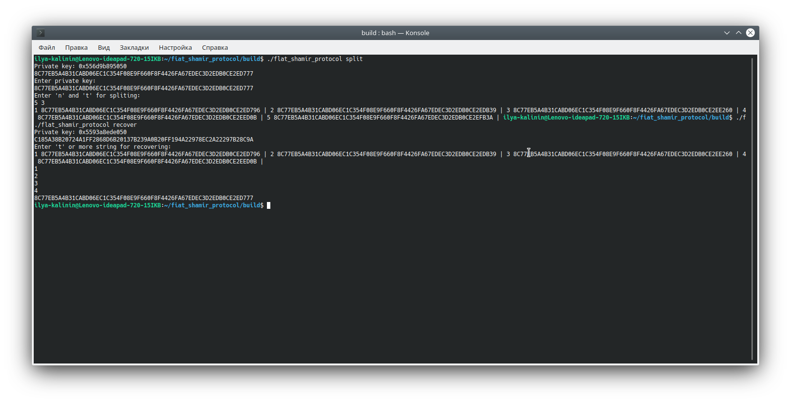

# Назначение

В данном репозитории хранится третье задание
по дицсиплине Разработчик криптографических протоколов
и децентраоизованных систем

# Описание

Сделать программу - консольное приложение, используя языки: С/C++, Rust, Python, Go, Node.JS. Код должен быть оформлен в  отдельный репозитарий на GitHub c инструкцией в README.md как собрать и запустить код в консоли под Ubuntu 18.04. К коду должен быть приложен скриншот одного из запусков в консоли.

Программа, разделяет секретную строку в hex формате длиной 256 bit (например, приватный ключ ECDSA secp256k1) на N частей по схеме Шамира и восстанавливает его при предъявлении любых T частей.

Аргументы командной строки:
Единственный аргумент указывающий режим работы программы:

разделение секрета:
./program split
восстановление секрета
./program recover

Входные данные - mode split (stdin):
1 строчка - Приватный ключ (P_KEY)
2 строчка - Два числа N, T, где 2 < T <= N < 100

Выходные данные - mode split (stdout):
N строк, в каждой строке содержится кусочек разделенного секрета(в виде string)

Входные данные - mode recover (stdin):
T или более строк с кусочками секрета(в каждой строке кусок секрета в том же формате что и вывод программы в режиме split)

Выходные данные - mode recover (stdout):
Приватный ключ (P_KEY), в таком же виде что и перед разделением

# Использование

1. Клонируйте данный репозиторий на свою машину.

2. Запустите `mkdir build && cd build` для создания директории сборки.

3. Запустите `cmake ..` для создания файлов сборки.

4. Запустите `make` для сборки

5. Запустите команду в формате "./flat_shamir_protocol <_mode>
где: <_mode> - режим работы программы.

## Примечания к запуску

Заранее собранный проект лежит в репозитории, возможно перейти по `cd build`. Допускается сразу перейти к пункту использования "5".

После запуска программы генерируется приватный ключ для удобства проверки работы программы.

# Примеры работы программы

​

​

    
# Авторы и права на использование

Автор: Калинин Илья

Файлы, содержащиеся в данном репозитории, являются общественным достоянием
и могут использоваться, модифицироваться и распространяться без ограничений.

# Связь

Замечания можно присылать на адрес <kalinin.abs@gmail.com> или в telegram @mozabs
